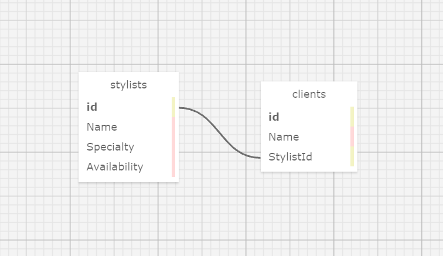

# Eau Claire's Salon

#### A web application that allows a salon owner to track their stylists and clients.

#### By Anna Clarke


## Salon Database


## Technologies Used

* _C#_
* _ASP.NET Core MVC_
* _.NET 5_
* _NuGet_
* _Entity FrameWork Core_

## Description

This web application allows Claire, owner of Eau Claire's Salon, to track her stylists and their clients. The user can add stylists, including their name, specialty, and availability. They can view all stylists and each stylist details including a list of clients for that stylist. The user can add a client to a specific stylist.

### Technology Requirements

* [.NET 5](https://dotnet.microsoft.com/download/dotnet/5.0)
* A text editor like [VS Code](https://code.visualstudio.com/)

## Setup/Installation Requirements

* Clone this repository to your desktop
* Open in text editor
* Create appsettings.json in main project directory /HairSalon/HairSalon/
* Copy this code into appsettings.json, replacing YOUR_PASSWORD with your MySQL password:
```
{
  "ConnectionStrings": {
      "DefaultConnection": "Server=localhost;Port=3306;database=anna_clarke;uid=root;pwd=YOUR_PASSWORD;"
  }
}
```
* open new terminal and run SQL `$ mysql -uroot -p{your_password}`
* open MySQL Workbench
* In the Navigator > Administration window, select Data Import/Restore.
* In Import Options select Import from Self-Contained File
* Navigate to anna_clarke.sql
* Under Default Schema to be Imported To, select the New button & Enter anna_clarke as name of database
* Click Ok
* Navigate to the tab called Import Progress and click Start Import at the bottom right corner of the window
* After you are finished with the above steps, reopen the Navigator > Schemas tab. Right click and select Refresh All. The anna_clarke database should appear.
* In terminal, navigate into HairSalon/HairSalon/ and enter the command `$ dotnet restore`, to install necessary packages
* enter command `$ dotnet build`, to build program
* enter command `$ dotnet run`, to view application in your browser

## Known Bugs

* _NA_

## License

_[MIT](https://opensource.org/licenses/MIT)_  

Copyright (c) 2021 Anna Clarke

## Contact Information

Anna Clarke: <anclarkie@gmail.com> 